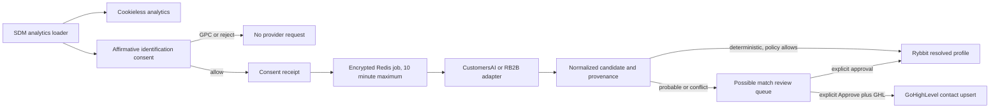

# Provider-neutral visitor identity

Status: implemented, disabled by default, awaiting provider sandboxes and contract approval.

Agency Analytics owns consent, orchestration, normalized profiles, review, scoring, CRM routing, MCP, reporting, deletion, and suppression. CustomersAI, RB2B, and PDL are replaceable signal providers. OSPRY is not used.

## Runtime flow



The ordinary tracker runs whether identification is accepted or rejected. GPC forces rejection. The server derives country from the transient request IP and fails closed outside the United States or when location cannot be resolved; a browser-supplied region is never trusted. Provider network context is AES-256-GCM encrypted before it enters BullMQ and is removed on completion. Raw IP addresses, user agents, raw provider responses, provider identifiers, form fields, messages, health data, legal data, birth dates, phone numbers, and home addresses are not written to Postgres or ClickHouse.

## Provider contract

Adapters accept a sanitized provider response in this shape:

```json
{
  "request_id": "provider-request-id",
  "candidates": [
    {
      "id": "provider-subject-id",
      "confidence": 0.97,
      "match_method": "deterministic",
      "traits": {
        "name": "Jane Doe",
        "email": "jane@example.com",
        "company": "Example Inc",
        "title": "Owner",
        "linkedinUrl": "https://www.linkedin.com/in/example",
        "location": "Phoenix, Arizona"
      }
    }
  ]
}
```

Unknown fields cause the response to be rejected. Provider subject IDs are immediately converted to a site-scoped HMAC key. Conflicting candidates never auto-link. PDL only fills missing allowed fields and never overwrites an existing field.

Exact vendor URLs are configuration, not source defaults. Set them only from the provider's current signed sandbox documentation:

- `CUSTOMERS_AI_RESOLVE_URL`, `CUSTOMERS_AI_HEALTH_URL`, `CUSTOMERS_AI_DELETE_URL`, `CUSTOMERS_AI_API_KEY`, `CUSTOMERS_AI_WEBHOOK_SECRET`
- `RB2B_RESOLVE_URL`, `RB2B_HEALTH_URL`, `RB2B_DELETE_URL`, `RB2B_API_KEY`, `RB2B_WEBHOOK_SECRET`
- `PDL_ENRICH_URL`, `PDL_API_KEY`
- Required positive per-request cost ledger inputs: `CUSTOMERS_AI_COST_MICROS`, `RB2B_COST_MICROS`, `PDL_COST_MICROS`. Missing, zero, fractional, or non-finite pricing fails closed before provider approval, activation, or network access.
- Organization pilot cap: `IDENTITY_PILOT_MONTHLY_BUDGET_CENTS`, validated as a finite integer from $0 through $750. Invalid or excessive values fail closed. Atomic Redis reservations enforce both site and organization caps before a provider token or job is issued.
- Optional SDM-owned pixel bridge: `IDENTITY_CONNECTOR_URL`. It must share the analytics application's origin and loads only after consent.

## Activation gates

Activation requires all of the following:

1. DPA, subprocessors, webhook-signing scheme, deletion support, and sandbox schema are recorded.
2. Written rights cover export, normalized storage, client display, deletion, and provider replacement.
3. Monthly commitment is below $750.
4. The provider connection durably records all six data-rights attestations, the approving administrator, and `status=approved`.
5. The site has `complianceState=approved`, is not on the hard block list, and has a daily and monthly cap.
6. The provider health test passes.
7. Shadow mode remains enabled for the 14-day pilot.

Organization API:

- `GET /api/organizations/:organizationId/providers`
- `PUT /api/organizations/:organizationId/providers/:provider`
- `POST /api/organizations/:organizationId/providers/:provider/test`

Site API:

- `GET/PATCH /api/sites/:siteId/resolution-settings`
- `GET /api/sites/:siteId/identity-candidates`
- `POST /api/sites/:siteId/identity-candidates/:candidateId/approve`
- `POST /api/sites/:siteId/identity-candidates/:candidateId/reject`
- `POST /api/sites/:siteId/identity-candidates/:candidateId/suppress`
- `POST /api/sites/:siteId/identity-candidates/:candidateId/brief`
- `GET /api/sites/:siteId/provider-usage`

Public tracker API:

- `POST /api/identity/consent`
- `POST /api/identity/withdraw`
- `POST /api/identity/provider-webhooks/:provider`

Webhook signatures use `X-Identity-Timestamp` and `X-Identity-Signature`, where the signature is the hex HMAC-SHA256 of `<unix timestamp>.<raw request body>`. The allowed clock skew is five minutes. Redis rejects successfully accepted replayed event IDs for 24 hours. Validation, inactive-consent, and disabled-ingestion rejections release the in-flight marker so a corrected provider retry is not silently discarded. The signed correlation token binds the event to one site, consent receipt, anonymous subject, and short expiration.

## Review, scoring, and CRM

The Users screen contains a Possible matches queue with provenance, confidence, ICP score, cost, and review actions. The ICP score is deterministic and cannot alter provider confidence. Optional AI briefs exclude name and email from the LLM prompt and cannot approve, reject, merge, or route a profile.

GoHighLevel routing requires a separate `Approve + GHL` action. No workflow, email, SMS, call, or sequence is started. Site credentials are read from `GHL_SITE_CREDENTIALS_JSON` or the equivalent site-scoped server variables and never returned to the client.

MCP adds separately scoped `identity:read` and `identity:write` tools for candidates, usage, briefs, approval, rejection, suppression, and optional GHL routing.

## Withdrawal and retention

Withdrawal revokes active receipts, deletes candidates, aliases, resolved profiles, and associated analytics/replay rows, then creates a non-reversible site-scoped suppression HMAC. The same Postgres transaction writes an encrypted provider-deletion outbox record before local candidate data is removed. A queue outage or process crash therefore cannot lose the provider deletion request, and a failed database transaction cannot contact the provider while retaining the local profile. Sanitized activation audit records remain after their candidate is deleted. Candidate records expire after 30 days. Resolution attempts, inactive consent proof, and usage data follow each site's configured identity retention period. Suppression hashes remain so a deleted person is not re-identified.

Provider-side deletion uses an encrypted subject reference, transactional outbox, periodic pending-record dispatcher, and dedicated retry queue. The outbox is marked complete only after the provider accepts deletion; terminal failures remain durable for operator recovery. Approval and health checks fail closed unless the provider's documented deletion endpoint is configured. The endpoint must be contract-tested with the provider sandbox before a site can leave shadow mode; until then the adapter stays disabled.

Provider usage is finalized once per logical resolution attempt. Transient BullMQ retries remain `queued` and do not increment aggregate request, failure, enrichment, or cost totals; the terminal success or failure claims the attempt and usage rows in one transaction.

## Pilot

Palm Squad is the consumer pilot. Start with CustomersAI in shadow mode and compare only against later first-party verified leads. Production activation requires at least 85% precision, no ambiguous confirmed identity, cost below $1 per confirmed identity, no budget overrun, and verified withdrawal/deletion. Medical, health, legal, and simulated-delivery sites remain blocked regardless of banner state.
