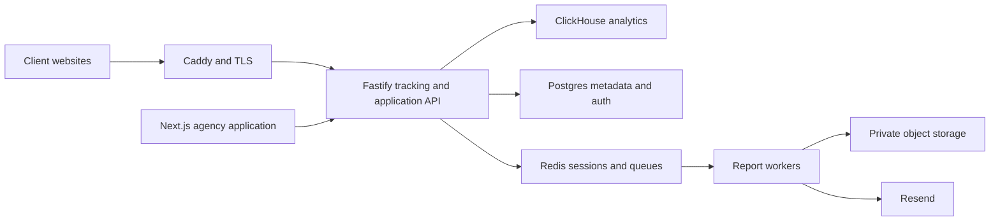

# Agency Analytics Technical Specification

## Architecture

- Next.js 16 App Router renders the existing site analytics and new agency routes.
- Fastify owns authorization, client lifecycle, reporting commands, and analytics access.
- Postgres is canonical for agency clients, sites, permissions, schedules, runs, and audit events.
- ClickHouse remains canonical for analytics, sessions, replays, Web Vitals, bots, and monitor events.
- Redis remains the session and BullMQ boundary.
- The event ingestion payload is unchanged in v1.

## Fork boundaries

- Custom UI lives under `client/src/app/(agency)` and `client/src/components/agency`.
- Custom client API code lives under `client/src/api/agency`.
- Custom server handlers and services live under `server/src/api/agency` and `server/src/services/agency`.
- Shared public contracts live in `shared/src/agency.ts`.
- Existing `/{site}` routes and analytics query code are reused instead of copied.

## Postgres schema

### agency_clients

| Column | Type | Rules |
| --- | --- | --- |
| id | text | Primary key |
| organization_id | text | Required FK to organization, cascade delete |
| team_id | text | Required unique FK to team, cascade delete |
| name | text | Required |
| slug | text | Required; unique within organization |
| status | text | `active`, `onboarding`, `paused`, `archived` |
| logo_url | text | Optional |
| timezone | text | Required IANA timezone |
| external_ref | text | Optional future integration identifier |
| created_at / updated_at | timestamp | Required |

### agency_client_sites

| Column | Type | Rules |
| --- | --- | --- |
| id | serial | Primary key |
| client_id | text | Required FK to agency client |
| site_id | integer | Required unique FK to sites |
| is_primary | boolean | Default false |
| tracking_method | text | `script`, `gtm`, `cms`, `proxy` |
| tracking_status | text | `pending`, `verified`, `stale`, `error` |
| verified_at / last_checked_at | timestamp | Optional |

### reporting and audit

- `report_schedules`: client, cadence, timezone, send rules, site scope, enabled state, next run.
- `report_recipients`: schedule, name, email, locale, enabled state.
- `report_runs`: period, status, summary JSON, artifact key, attempts, error summary, timestamps.
- `agency_audit_events`: organization, optional client, actor, action, target, sanitized metadata, timestamp.
- `tracking_deployments`: organization/client/site, provider, action, queue status, public input, sanitized result, actor, error summary, and lifecycle timestamps. Credentials are environment-only.

Client creation and site assignment update the agency tables and Rybbit team access tables in one Postgres transaction.

## Shared contracts

`AgencyClient`, `AgencyClientSite`, `ClientSummary`, `OnboardingState`, `TrackingDeployment`, `ReportSchedule`, `ReportRecipient`, and `ReportRun` are exported from `@rybbit/shared`. Dates cross the HTTP boundary as ISO 8601 strings.

## HTTP interfaces

- `GET/POST /api/organizations/:organizationId/clients`
- `GET/PATCH /api/organizations/:organizationId/clients/:clientId`
- `POST/DELETE /api/organizations/:organizationId/clients/:clientId/sites`
- `GET /api/organizations/:organizationId/clients/:clientId/summary`
- `GET /api/organizations/:organizationId/clients/:clientId/onboarding`
- CRUD under `/api/organizations/:organizationId/clients/:clientId/report-schedules`
- `GET /api/organizations/:organizationId/clients/:clientId/report-runs`
- `POST /api/organizations/:organizationId/clients/:clientId/report-runs/:runId/retry`
- `GET /api/organizations/:organizationId/clients/:clientId/sites/:siteId/tracking-deployments`
- `POST /api/organizations/:organizationId/clients/:clientId/sites/:siteId/tracking-deployments/plan`
- `POST /api/organizations/:organizationId/clients/:clientId/sites/:siteId/tracking-deployments/:deploymentId/{apply|status|rollback}`

Every handler validates Zod input, verifies organization membership, derives accessible sites on the server, and returns `{ error: string, details?: unknown }` for failures.

## Preline integration

- Install `preline` and `@tailwindcss/forms` using the client's existing npm workflow.
- Add Preline Tailwind v4 source and variant imports to `globals.css`.
- Mount a client-only loader after routed content in the root layout.
- Dynamically import `preline/non-auto` and call `HSStaticMethods.autoInit()` after pathname changes.
- New agency routes use public Preline markup patterns and existing Rybbit tokens. Existing chart libraries and mature Radix behavior remain.

## Report execution

- Scheduler enqueues only schedule IDs; workers reload canonical state before execution.
- The worker resolves site access server-side, calculates the period in the schedule timezone, renders aggregate content, uploads a private artifact, records the run, and sends through Resend.
- Retries use bounded exponential backoff and idempotency key `scheduleId:periodStart:periodEnd`.
- Recipient email addresses and artifact keys never enter analytics events or browser logs.

## Performance and scale

- Initial envelope: 25–100 sites and 1–10 million events/month.
- Dashboard p95 target: under two seconds for 30-day queries.
- Scale triggers: CPU or disk over 70%, ingestion lag over one minute, or p95 above target.
- First resize: CCX33-equivalent. Second step: separate ClickHouse/data and application tiers.

## Managed tracking deployment

Tracking installation uses two provider adapters with the same contract: explicit domain-to-site mapping, read-only plan, apply, installation verification, event verification, and rollback.

### Cloudflare edge adapter

- `infra/tracking-edge` targets websites already proxied through Cloudflare, regardless of whether the origin is WordPress or Vercel.
- One site-scoped Worker per Rybbit site ID handles `hostname/*`. It passes origin traffic through, injects the tracker only into public HTML, and proxies `/<reserved-prefix>/*` to the matching Agency Analytics `/api/*` path.
- The same-origin proxy reduces ad-blocker and CSP failures. Existing script nonces are reused; nonce-required pages without an available nonce are not modified.
- Plan fails for DNS-only hostnames, exact or inherited all-path Worker route conflicts, existing tracker conflicts, and missing token permissions.
- Site-scoped scripts prevent a partial manifest from replacing another client's hostname mapping.

### Vercel source adapter

- `infra/tracking-vercel` resolves the Vercel project, connected GitHub repository, production branch, monorepo root, Next.js version, TypeScript usage, and production CSP.
- Next.js 15.3+ receives a single managed `instrumentation-client.ts|js` file. Existing instrumentation is never overwritten.
- Apply creates an auditable `codex/agency-analytics-<siteId>` PR. Vercel's Git integration creates the preview; the adapter never merges or promotes production automatically.
- Installation acceptance requires the Vercel preview to be ready, a real browser load with no tracker/CSP error, and a received event confirmed through the existing Agency Analytics **Verify** action.

### WordPress fallback

Cloudflare-proxied WordPress uses the edge adapter. A DNS-only WordPress site can install and activate the public `integrate-rybbit` plugin through WordPress's authenticated plugin REST API, but that plugin does not expose its site ID and self-hosted script URL through REST. Full zero-touch configuration therefore requires WP-CLI/SFTP access or a separately reviewed managed connector plugin. The system must not claim full automatic installation when only an Application Password is available.

### Application integration

The client onboarding UI invokes the provider contract through BullMQ. Every job reloads canonical organization/client/site assignment before execution; follow-up apply, status, and rollback jobs are bound to the original completed run. The browser receives sanitized plan/status data only. Provider tokens, repository credentials, and WordPress application passwords remain server-side.
